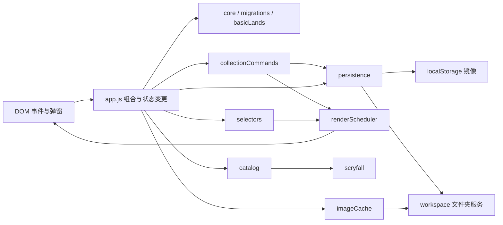

# Arcana Cube Architecture

本文记录当前模块边界和变更规则。目标是让功能继续增长时，数据兼容、文件夹可迁移性和 600 张牌规模下的交互性能仍然可预测。

## 总体数据流



`app.js` 是唯一的浏览器组合入口。它持有运行状态、响应 DOM 事件、调用服务并显示 toast；规则计算、网络、文件系统、缓存与调度分别由独立模块负责。模块采用 UMD 形式，在浏览器中挂到 `window`，在 Node 测试中通过 CommonJS 导入。

## 模块职责

| 模块 | 负责 | 不负责 |
| --- | --- | --- |
| `migrations.js` | 按版本升级 Cube 数据，拒绝未知未来版本 | UI 和持久化 |
| `core.js` | 卡牌规范化、正面分类、排序筛选、统计、导入导出 | 网络和 DOM |
| `basicLands.js` | 五种基本地的编号区间解析、分组排序和批量添加判定 | DOM、网络请求和状态写入 |
| `collectionCommands.js` | 一次收藏变更的日志、保存、渲染和反馈副作用顺序 | 业务校验和数据变更 |
| `viewPreferences.js` | 枚举型视图偏好的规范化读写与存储异常降级 | Cube 业务数据 |
| `priceHistory.js` | 每日快照、趋势、逐卡价格索引 | Scryfall 请求 |
| `changeLog.js` | 改动记录规范化、限长、文件包装 | 触发业务操作 |
| `health.js` | 只读分析文件夹缺图、孤立文件和数据完整性 | 修复或删除文件 |
| `storage.js` | 浏览器 Cube 镜像、工作区包装、目录句柄存储 | 业务域调度 |
| `workspace.js` | File System Access 权限、三个 JSON 文件和图片文件 IO | 下载和状态管理 |
| `workspaceSession.js` | 绑定 Cube 身份并整体解析三个工作区数据域 | 文件 IO 和界面确认 |
| `persistence.js` | 脏域快照、延迟合并、浏览器/文件夹写入协调 | 数据格式解释 |
| `scryfall.js` | 通用 JSON 请求、重试、取消和 HTTP 错误 | 卡牌查询策略 |
| `catalog.js` | 名称、印刷版本、Oracle 分页和批量查询 | UI 和本地文件 |
| `priceMaintenance.js` | 把批量查询结果安全应用到当前牌张并汇总刷新结果 | 发起网络请求和显示反馈 |
| `chart.js` | 按真实日期计算价格曲线横轴坐标 | DOM 和价格数据存储 |
| `imageCache.js` | 原图下载、精确命名、缩略图补全和进度 | Canvas 实现和目录选择 |
| `selectors.js` | 按修订号缓存筛选、分组、统计、分析和价格视图 | 修改状态 |
| `renderScheduler.js` | 合并渲染请求并按固定顺序执行区域刷新 | 决定业务失效范围 |
| `app.js` | 依赖组装、状态变更、DOM 和用户反馈 | 可复用领域算法 |

## 状态与保存

运行状态中持有三个可持久化域：

| 域 | 浏览器镜像 | 文件夹文件 | 典型变更 |
| --- | --- | --- | --- |
| `cube` | `arcana-cube-v1` | `cube-data.json` | 牌张、版本、Finish、日印、名称、说明、图片引用 |
| `priceHistory` | `arcana-cube-price-history-v1` | `price-history.json` | 每日逐卡与总价快照 |
| `changeLog` | `arcana-cube-change-log-v1` | `change-log.json` | 添加、删除、换版、导入、价格和存储操作记录 |

状态变更完成后调用 `saveState(domain)` 或 `saveState(domains)`，只标记真正变化的域。协调器立即保存普通浏览器镜像；文件夹模式把同一域的连续快照合并，并按 `cube`、`priceHistory`、`changeLog` 顺序串行写入。笔记输入使用短延迟合并，`blur` 会刷新待写内容，`pagehide` 至少同步保存浏览器镜像。

文件夹写入失败时，该域保持 dirty，不能把“已写入文件夹”当作成功。断开和显式写入文件夹前必须先 `flush()`；“从文件夹重载”只允许在没有 dirty 域时执行，并且不能先写后读。不要绕过 `persistence.js` 直接为普通业务变更写 JSON 文件。

三个文件共享同一个 `cubeId`。`workspaceSession.js` 会为旧辅助文件补上主牌表的身份，缺失辅助文件使用空数据；身份不一致时停止载入，禁止把不同 Cube 的价格历史或改动记录拼接在一起。

名称语言和基本地分组属于非关键视图偏好，由 `viewPreferences.js` 单独写入 `localStorage`。它们不进入 `cube-data.json`；无效旧值或浏览器拒绝存储时使用默认值，不得影响 Cube 数据加载和保存。

## 收藏变更流程

版本替换、Finish、日印、单张/批量添加以及删除撤销遵循同一流程：

1. `app.js` 完成业务校验并修改内存状态。
2. `collectionCommands.execute()` 记录一条或多条 change log，记录阶段不单独持久化。
3. 整个用户操作只调用一次 `saveState()`，一次标记所有变化域。
4. 请求最小渲染范围，最后显示一次反馈；无实际变化的命令不产生任何副作用。

命令执行器不修改状态，也不判断某张牌是否合法。新增收藏操作时应把规则留在领域模块或 `app.js` 的协调函数里，只把统一的操作结果描述交给执行器。

## 派生数据

`dataRevision` 在 `cube` 变更后递增，`historyRevision` 在价格历史变更后递增。`selectors.js` 用数据引用、修订号和筛选条件作为缓存键：

- `selectCards` 返回已排序的筛选结果及颜色分组。
- `selectStats` 和 `selectAnalytics` 复用统计结果。
- `cardById` 使用索引定位卡牌。
- `selectPriceView` 一次扫描历史，建立逐卡最新两点趋势和总价序列。

任何直接修改 `state.data` 或 `state.priceHistory` 的代码，都必须随后通过正确域调用 `saveState`，否则修订号不会失效，界面可能继续使用旧派生结果。

## 渲染失效

渲染区域固定为 `meta`、`stats`、`nameLanguage`、`cards`、`basics`、`analytics`、`storage`。常见失效规则如下：

| 操作 | 请求区域 |
| --- | --- |
| 搜索、筛选、显示模式 | `cards` |
| 修改 Cube 名称或简介 | `meta` |
| 切换名称语言 | `nameLanguage`, `cards`, `basics` |
| 基本地分组 | `basics` |
| Finish 或日印 | `stats`，并优先替换单卡节点；筛选不再匹配时回退到 `cards` |
| 添加、删除、换版、导入 | `meta`, `stats`, `cards`, `analytics` |
| 基本地添加、删除或换版 | `basics`, `stats` |
| 价格刷新 | `stats`, `cards` |
| 启动、恢复、文件夹重载 | `renderAll()` |

搜索输入由 `requestAnimationFrame` 合并，保持即时反馈但每帧最多重建一次牌表。图片错误使用 `cardGrid` 上的单个捕获监听，禁止在每次 `renderCards()` 后逐图绑定事件。

## 扩展规则

1. 卡牌分类、筛选、排序或导入格式变化放在 `core.js`，先补纯函数测试；五种基本地专属规则放在 `basicLands.js`。
2. 新的 Scryfall 用例放在 `catalog.js`；只有传输、重试或取消策略才改 `scryfall.js`。
3. 新的文件夹数据必须先定义独立保存域及兼容格式，再扩展 `workspace.js` 和 `persistence.js`。
4. 新的派生视图放入 `selectors.js`，用明确修订号失效，不在卡片模板循环中重复扫描全量数据。
5. 新的收藏修改应通过 `collectionCommands.js` 汇总副作用，并请求最小渲染区域；只有跨区域载入或恢复才调用 `renderAll()`。
6. 仅影响显示的枚举选项放入 `viewPreferences.js`；会随 Cube 文件夹迁移的数据必须进入正式数据域并通过 migration 演进。
7. 真实 `cube-data.json`、价格历史、改动记录和 `images/` 始终保持 Git 忽略。

## 本地服务

`scripts/local-server.js` 同时提供静态文件和 Scryfall 图片代理。默认只监听 `127.0.0.1:4173`；局域网测试可显式运行：

```sh
npm run serve -- --host 0.0.0.0 --port 4173
```

`--host` 只改变监听地址，不改变浏览器文件夹授权模型。日常单机使用保留默认回环地址，只有确实需要局域网访问时才开放监听。

## 验证工作流

```sh
npm run check
npm test
npm run test:browser
git diff --check
```

单元测试使用 `testFixtures.js` 生成确定性的 600 张牌和 180 天价格历史，覆盖大规模筛选、统计、价格索引、文件写入合并与渲染调度。`npm run test:browser` 会启动隔离的本地服务和临时 Chrome 配置，实际验证页面加载、弹窗、牌表筛选和组合分析筛选；涉及文件夹模式时仍应使用测试目录，不要对真实 Cube 数据做破坏性操作。
